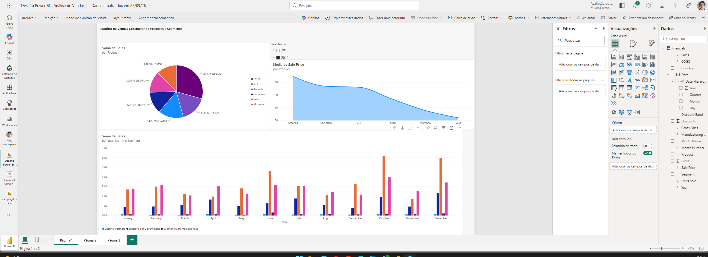
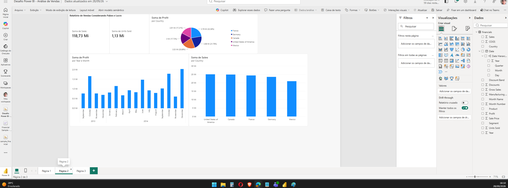
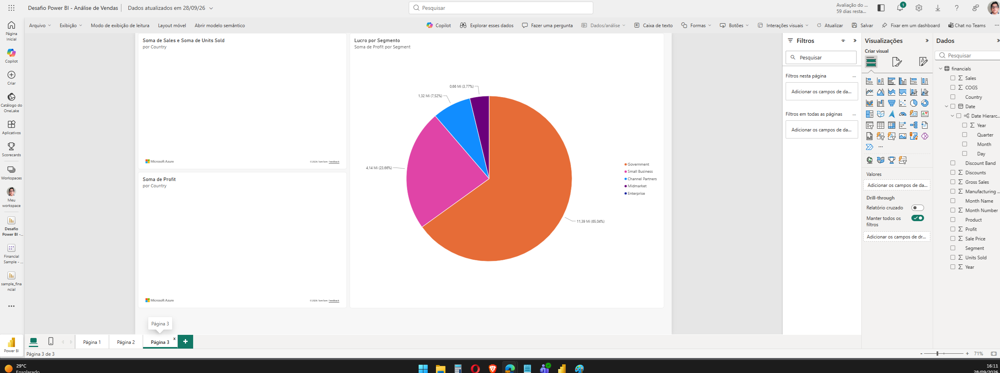

# 📊 Desafio Power BI — Análise de Vendas

Projeto desenvolvido como parte da **Formação Power BI Analyst da DIO**, com o objetivo de praticar a criação e configuração de visualizações utilizando o Power BI.

O relatório foi desenvolvido utilizando o **Power BI Service (versão web)** a partir do dataset Financial Sample disponibilizado no curso.

---

## 🎯 Objetivo do projeto

Construir um relatório de vendas utilizando diferentes recursos de visualização de dados, incluindo:

- gráficos de pizza;
- gráficos de colunas;
- gráfico de área;
- cartões de indicadores;
- segmentação de dados;
- mapas;
- dicas de ferramentas;
- análise por produtos, segmentos, países, vendas e lucro.

---

# 📄 Página 1 — Produtos e Segmentos

A primeira página apresenta uma análise de vendas considerando produtos e segmentos.

Foram utilizados:

- Vendas por produto;
- Preço médio de venda por produto;
- Vendas por mês e segmento;
- Segmentação por ano e mês.

---

# 🌎 Página 2 — Países e Lucro

A segunda página apresenta os principais indicadores financeiros e comparações entre os países presentes na base.

Entre os indicadores estão:

- Total de vendas;
- Total de unidades vendidas;
- Lucro por país;
- Evolução do lucro por ano e mês;
- Vendas por país.

---

# 🗺️ Página 3 — Análise Geográfica

A terceira página foi desenvolvida como parte prática do desafio, utilizando diferentes recursos de mapas e análise por segmento.

Foram criados:

- **Vendas e unidades vendidas por país**;
- **Lucro por país**;
- **Lucro por segmento**.

O primeiro mapa também utiliza **Units Sold como dica de ferramenta (tooltip)**.

---

## 🛠️ Tecnologias utilizadas

**Power BI Service**  
**Power Query**  
**Microsoft Excel**  
**GitHub**

---

## 📂 Fonte dos dados

O projeto utiliza o dataset **Financial Sample**, disponibilizado no repositório da formação:

[Repositório Power BI Analyst — DIO](https://github.com/julianazanelatto/power_bi_analyst)

---

## 📚 Aprendizados

Durante o desenvolvimento deste projeto foram praticados conceitos como transformação e carregamento de dados, criação de modelos semânticos, configuração de campos em visualizações, hierarquias de datas, filtros, mapas, tooltips e organização de dashboards no Power BI.

---

## 👨‍💻 Autor

Projeto desenvolvido por **Bruno Daniel** como parte da Formação Power BI Analyst da DIO.
